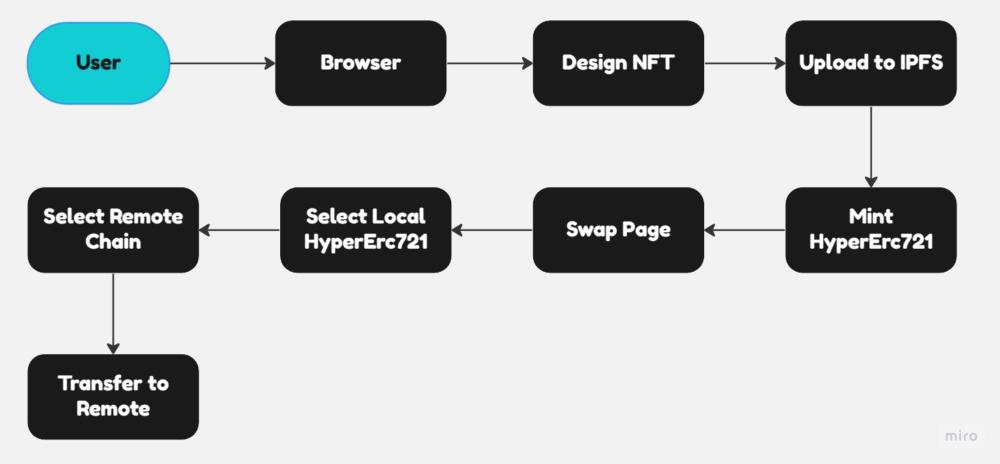

# Highway NFTs

## Links

- youtube: [https://youtu.be/QD-9s4zh2rI](https://youtu.be/QD-9s4zh2rI)
- website: [highway-nfts.vercel.app](highway-nfts.vercel.app)

## Overview

Our project is a unique application of the Hyperlane ERC721 technology, which enables the creation and transfer of non-fungible tokens (NFTs) across multiple blockchain networks. With this technology, users can mint and transfer their custom-designed avatar NFTs to any supported blockchain network in just one simple step

One of the key features of our platform is the integration of IPFS, a decentralized file storage system that ensures permanent and secure storage of NFT images. This allows users to upload their avatar designs to IPFS, ensuring they will remain accessible and preserved indefinitely

Our user-friendly interface simplifies the process of creating and transferring NFTs, making it accessible to both novice and experienced users. Through our platform, users can design their own unique avatar NFTs and transfer them across different blockchain networks with ease. This opens up a world of possibilities for creators, collectors, and enthusiasts who want to participate in the burgeoning NFT ecosystem

## Support Chains List

- ScrollAlpha <https://blockscout.scroll.io/address/0xEaB08b7987fAfB772b578236c9CAd4202DD11542>
- Ploygon Zk EVM <https://explorer.public.zkevm-test.net/address/0x2EEab2a64031c362D212ce0cD906aeFed439621c>
- Goerli <https://goerli.etherscan.io/address/0x448A2bB0A28C1e48e3553562EC050752208C8e42>
- OP-Goerli <https://goerli-optimism.etherscan.io/address/0xaB358fA22f9C3d2BDB47a22C49024b49192C02E5>
- Mumbai <https://mumbai.polygonscan.com/address/0xD910482D70B43607bb637ae1B14Eb8ba7866Fade>

## Document tree

```shell
├── contracts| hardhat framework
├── frontend | next.js framework
├── README.md
```

## FlowChart



## Install

```shell
cd frontend
npm install
npm run dev
npm run build
```

## Test

```shell
cd contract
npx hardhat test test/TestAcc.js

✔ Should receive mint NFT && transfer NFT (179ms)
CrossChainTestCase
✔ Should receive transfer NFT
```

## Teck Stack

- tailwindCss
- daisyUi
- next.js
- hyperlane
- hardhat
- ether.js

## Reference

- [1] tailwindcss https://tailwindcss.com/
- [2] dasyUi https://daisyui.com/
- [3] next.js https://nextjs.org/
- [4] ether.js https://docs.ethers.org/v6/
- [5] hyperlane https://www.hyperlane.xyz/
- [6] hardhat https://hardhat.org/

## License

SPDX short identifier: MIT
